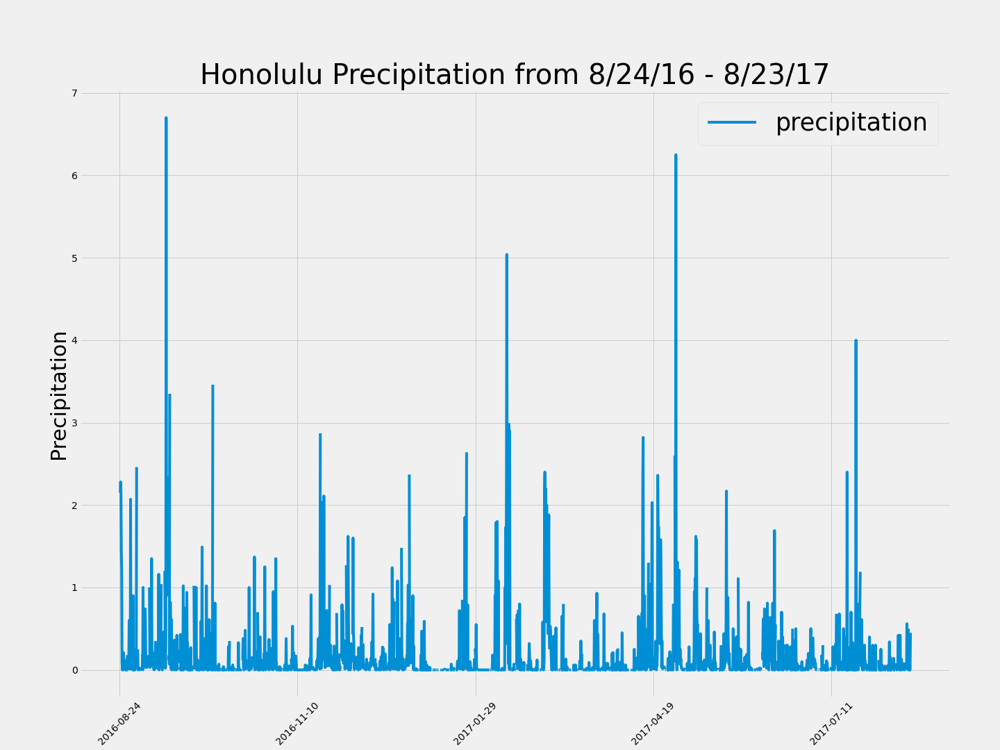
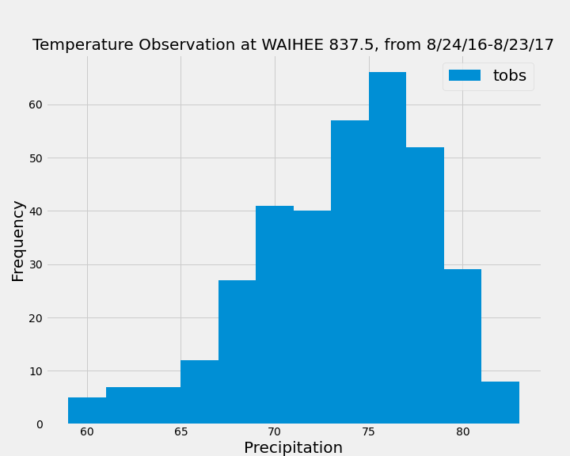

Congratulations! You've decided to treat yourself to a long holiday vacation in Honolulu, Hawaii! To help with your trip planning, you need to do some climate analysis on the area. The following outlines what you need to do.

## Step 1 - Climate Analysis and Exploration

The following analysis was completed using SQLAlchemy ORM queries, Pandas, and Matplotlib.

* First, I used SQLAlchemy to connect to the sqlite database and reflect the tables into two classes named `Station` and `Measurement`.

* Then I linked Python to the database by creating an SQLAlchemy session.

### Precipitation Analysis

* I stated by finding the most recent date in the data set.

* Using this data, I retrieved the last 12 months of precipitation data by querying the 12 preceding months of data.

* I then loaded the query results into a Pandas DataFrame and set the index to the date column and sorted by date.

* Next, I plotted the results using the DataFrame `plot` method.

  

* Lastly, I used Pandas to print the summary statistics for the precipitation data.

### Station Analysis

* Here I design a query to calculate the total number of stations in the dataset.

* I then designed a query to find the most active station(s).

  * After determining the most active station, I calculated the lowest, highest, and average temperature.

* Next, I designed a query to retrieve the last 12 months of temperature observation data (TOBS) and filtered by the station with the highest number of observations.

* After compiling this data, I plotted the results as a histogram.

    

- - - - - - - - - - - - - - - - - - - - - - - - - - - - - - - - - - - - - - - - 

## Step 2 - Climate App

After the initial analysis was completed, I designed a Flask API based on the queries that I just developed and used the following parameters for my routes:

### Routes

* `/`

  * List all routes that are available.

* `/api/v1.0/precipitation`

  * Convert the query results to a dictionary using `date` as the key and `prcp` as the value.

  * Return the JSON representation of the dictionary.

* `/api/v1.0/stations`

  * Return a JSON list of stations from the dataset.

* `/api/v1.0/tobs`
  * Query the dates and temperature observations of the most active station for the last year of data.

  * Return a JSON list of temperature observations (TOBS) for the previous year.

* `/api/v1.0/<start>` and `/api/v1.0/<start>/<end>`

  * Return a JSON list of the minimum temperature, the average temperature, and the max temperature for a given start or start-end range.

  * When given the start only, calculate `TMIN`, `TAVG`, and `TMAX` for all dates greater than and equal to the start date.

  * When given the start and the end date, calculate the `TMIN`, `TAVG`, and `TMAX` for dates between the start and end date inclusive.
